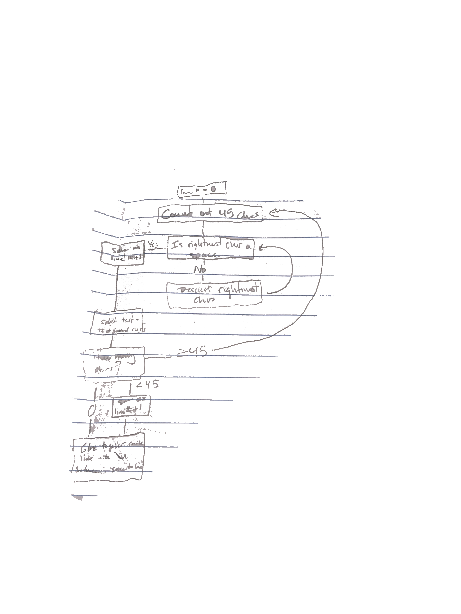

This project was an addition to a personal project that I started before the start of the term. I felt as though it would be a fun technical challenge to get back into the rhythm of coding.

Purpose:
This goal developed out of work with the image_annotat() function in the magick package. When inputting strings of text to be added, the text would run off of the image if it was too long. I devised a plan to automatically generate line breaks by editing the string with the inclusion of the newline sequence "`\n`".

I wanted to specify the width of a string before a new line break, and have the function cut it up into chunks of that length, then reassemble it with the newline sequence in between. The obvious problem was that I didn't want to cut the middle of words, so came up with a plan complicated enough that I felt the need to design a flowchart.



After selecting an initial character to line break at, the function would check to see if the character to the left was a space. If it was, then the line break was saved. If it wasn't then the end selection would shift one character and restart the check.

Once I had that written out, I simply started converting that idea into R code.

It was actually very satisfying to write code that was already planned out, and it was a pretty smooth process despite a couple of bugs that took many hours. I learned a lot after finding that the solution to the longest one was a lot simpler than I had assumed. I took that both as a lesson going forward, and also started a document to record all of my most arduous bugs, for technical reference in the future and for a record of ways to tackle these problems.

# 
# ```{r define line break function}
# chr_deselect <- function (quote_text){
#   if (length(quote_text) > 40) {
#     final_output <<- quote_text}
#   else {
#     if (str_sub(temp_select, chr_end, chr_end) == " "){
#       final_output <<- glue(final_output, "\n", temp_select)
#     } else {
#       chr_end <<- chr_end - 1
#       temp_select <<- str_sub(quote_text, chr_start, chr_end)
#       chr_deselect(quote_text)
#     }
#   }
# }
#   
# line_break <- function (quote_text) {
#   temp_select <<- str_sub(quote_text, chr_start, chr_end)
#   chr_deselect(quote_text)
#   end_select <<- str_sub(quote_text, (chr_end + 1), -1)
#   if (str_length(end_select) >= 40) {
#     line_break(end_select)
#   } else {
#     final_output <<- glue(final_output, "\n", end_select)
#   } 
# }
# 
# ```
# 
# ```{r running line break}
# run_line_break <- function (input_text) {
#   final_output <<- ""
#   chr_start <<- 1
#   chr_end <<- 40
#   line_break(input_text)
# }
# ```

This project set a strong start to this independent study, as well as a framework for motivated effort. If I was as focused on all my projects as I was with this one, I would find myself enjoying my work significantly more.