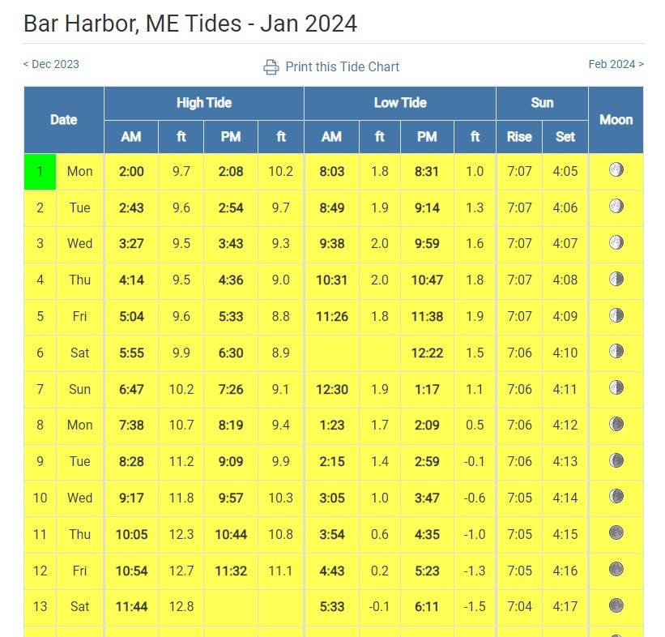
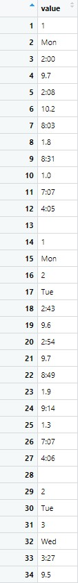
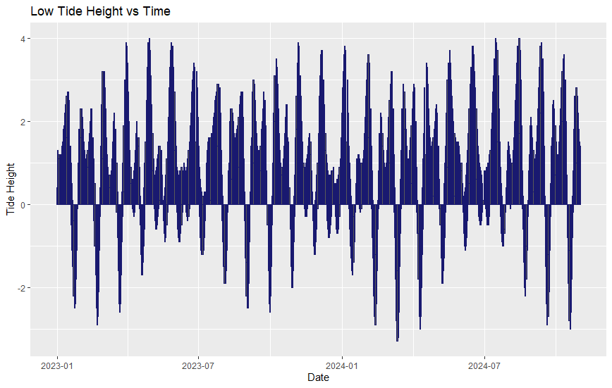
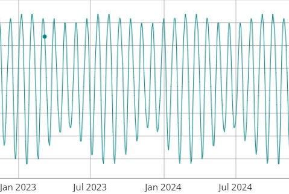

## Background

This project stemmed from an entirely different, non-data interested project of mine. Looking at variations in tidal height, I hypothesized that during the lowest low tide of the year, the depth between Bar Island and its neighbor, Bar Ledge would be shallow enough that one could walk across it. This ended up being correct, and I was able to walk out to Bar Ledge and back. This got me thinking though, is it possible to go during a tide so low that the bar is exposed? If so, when would that happen? This all got me asking more general questions, how do the most extreme low tides vary between lunar cycles, and when does that place the lowest upcoming low tides?

This built on my previous knowledge of lunar and tidal cycles. I understood that tides were most extreme during the full and new moon because being on the opposing/like side from the sun, the moon's force is amplified by the addition of the conjunction of the sun's graviatational force. Reversely, tides are least extreme during first and last quarter because the sun and moon are perpendicular to each other in relation to the Earth, and therefore are not contributing to the same graviational pull on our oceans. Thus, the most extreme low tide would be during a new or full moon, but how do those extremes vary beween cycles, and what other variables drive that variation?

## Process
I actually ended up writing this code twice, the first iteration taught me a side lesson in making sure files save in Rstudio. In both cases, the scraping ended up being more complicated than expected. This is because USharbors.com formats their tide charts with every value under the same CSS selector.



This meant that I had to find a way to extract the values from a table that looked like this.



To do this, I devised a line to select all the values of any given column, which was a really satisfying little bit of code to write.

```
filter(((row_number() - (number to select a given column)) %% 15) == 0)
```

I then wrote a function to build that data into a dataframe, and iterated the scrape across the year.

```scrape_low_tide <- function(month, year){

url <- str_c("https://www.usharbors.com/harbor/maine/bar-harbor-me/tides/?tide=", year, "-", month, "#monthly-tide-chart")

page <- read_html(url)

all_tide_data <- page %>% 
  html_nodes("td") %>% 
  html_text() %>% 
  as.tibble()

day <- all_tide_data %>% 
  filter(((row_number() - 1) %% 15) == 0)

low_am <- all_tide_data %>% 
  filter(((row_number() - 8) %% 15) == 0)

low_pm <- all_tide_data %>% 
  filter(((row_number() - 10) %% 15) == 0)

am_df <- data.frame(day, low_am) %>% 
  mutate(low_tide_date = dmy(str_c(value, "-", month, "-", year)))
pm_df <- data.frame(day, low_pm) %>% 
  mutate(low_tide_date = dmy(str_c(value, "-", month, "-", year)))
if (exists("low_df")) {
  low_df <<- bind_rows(low_df, am_df, pm_df) %>% 
  select(-value)
} else {
low_df <<- bind_rows(am_df, pm_df)
  }
}

for (x in 1:12) {
  scrape_low_tide(x, 2023)
}
```
The product looks like this, which tells a lot!



The variation in low tide extremes is very regular, even having some visible sinosiodal curves. But what's causing this? Because I knew that the distance of the moon from the earth varies, I decided to check for similarities in those graphs. Using a visualization from [theskylive.com](theskylive.com/how-far-is-moon), I found this curve, which lines up perfectly.



As I learned in Intro To Oceanography, tides are immensely complicated and vary greatly depending on where in the world they occur. The large number of variables which have a substantial effect make it difficult to understand which is causing specific variation, so this journey has been greatly enjoyable. By scraping and visualizing my own data, I've been able to get a far firmer understanding of this concept than if I had read online that the moon's proximity to earth causes variation in the tidal extremes from one lunar cycle to the next. This project has set a precedent which I intend to follow into the future, that if I don't understand a concept, getting hands on and working with the data gives me a sound, in depth comprehension that is not possible otherwise.

And if you happen to need to find me on March 25th, 2024 at low tide, you will most certainally need to train your binoculars on Bar Ledge, becuase I'll out be there enjoying the shallowest water all year.
