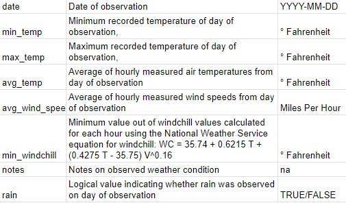
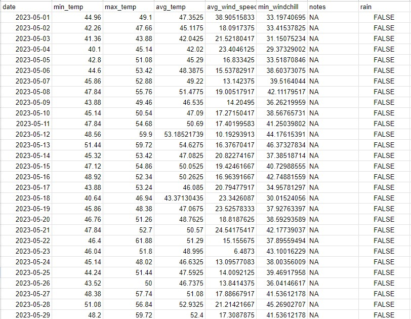

## Background

The need for a data set to be built arose out of a miscommunication between the Edward McCormick Blaire Research Station on Mount Desert Rock and the Alice Eno Research Station on Great Duck Island. A research project on GDI attempted to observe any correlations between various weather conditions and fledgling success on both islands. The data collection was conducted, but the weather conditions on Mount Desert Rock were not recorded the way that the project leader had intended. Thus, a supplementary dataset was required, and instead of building one based on daily observations in the field, we sought to build one posthumously with data collected by the weather buoy at the station.

## Process

The actual process was not all that exciting, but taught many lessons. To access the data, we downloaded it as a txt file from NOAA. There was then a large process of cleaning the data, and mutating each column and converting it to be the intended variable and unit. It was a process of finding various bits of data from several sources and making it all work.

```
data_2023 <- read_csv("2023_all_season_data.csv")
mdr_notes_2023 <- read_csv("mdr_notes.csv")
data_2023 <- data_2023 %>% 
  mutate(wind_speed_mph = wind_speed * 2.237) %>% 
  mutate(air_temp_f = (air_temp * 1.8) + 32) %>% 
  select(-wind_speed, -air_temp) %>% 
  mutate(date_full = str_c(year, "/", month, "/", day, " ", hour, ":00:00")) %>% 
  mutate(date_full = ymd_hms(date_full)) %>% 
  select(wind_speed_mph, air_temp_f, date_full) %>% 
  filter(row_number() != 429)


max_temp_table <- data_2023 %>% 
  group_by(date(date_full)) %>% 
  filter(air_temp_f == max(air_temp_f)) %>% 
  mutate(max_daily_temp_f = air_temp_f) %>% 
  mutate(day_date = date(date_full)) %>% 
  select(max_daily_temp_f, day_date)

min_temp_table <- data_2023 %>% 
  group_by(date(date_full)) %>%
  mutate(avg_air_f = mean(air_temp_f)) %>%
  filter(air_temp_f == min(air_temp_f)) %>% 
  mutate(min_daily_temp_f = air_temp_f) %>% 
  mutate(day_date = date(date_full)) %>% 
  select(min_daily_temp_f, day_date, avg_air_f)

min_wind_chill_table <- data_2023 %>% 
  group_by(date(date_full)) %>% 
  mutate(avg_wind_mph = mean(wind_speed_mph, na.rm = TRUE)) %>% 
  mutate(wind_chill = ((((0.4275 * air_temp_f) - 35.75) * (wind_speed_mph^0.16)) + (0.6215 * air_temp_f) + 35.74)) %>%
  filter(wind_chill == min(wind_chill)) %>% 
  mutate(min_wind_chill = wind_chill) %>% 
  mutate(day_date = date(date_full)) %>% 
  select(min_wind_chill, day_date, avg_wind_mph)


test <- mdr_notes_2023 %>%
  left_join(max_temp_table, by = "day_date") %>%
  left_join(min_temp_table, by = "day_date") %>% 
  left_join(min_wind_chill_table, by = "day_date") %>% 
  group_by(day_date) %>%
  select(day_date, min_daily_temp_f, max_daily_temp_f, avg_air_f, avg_wind_mph, min_wind_chill, notes) %>% 
  distinct() %>% 
  write_csv("mdr_2023_season_weather.csv")
```

The big lessons here were in communication though. After building one iteration of the data set, I found the product to still be messy, inaccurate, and incompatible with the GDI dataset. Only by reworking the process and writing a codebook to be more intentional and specific was I able to build a satisfactory product. 



Being the basis of all data science, starting with good data is extremely important. Attention to detail is essential, and if we had accepted the initial dataset full of unit conversion errors and formatting differences, the final conclusions of the study would have been innacurate. The real solution is to do it right from the start, and building a clear and tidy codebook prior to any data collection would have prevented this issue from happening. Truly one of the most valuable lessons I have learned in Data Science is the importance and methods of collecting good data, and I will take that lesson with me forward. Being one of the Field Station Managers for the MDR 2024 field season, I now intend to devote time to ensuring that the data collection of every research project is clear, accurate, and tidy. I understand how valuable this is for analysis and collaboration and am grateful that experiences such as this project have given me that. understanding.

