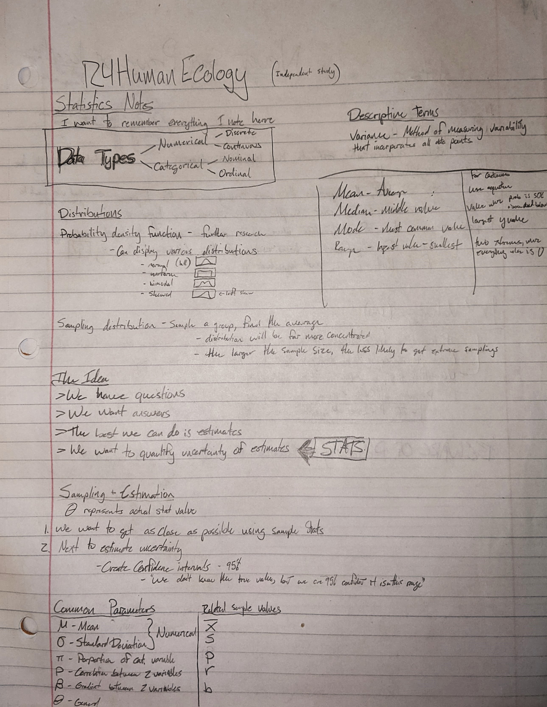
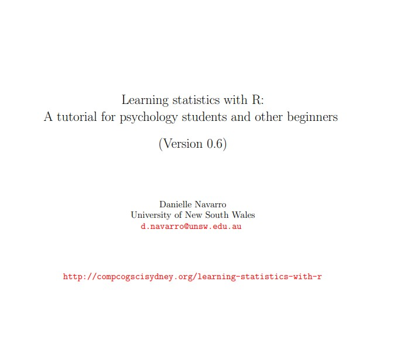

## Background
In senior year of high school I had a choice between taking Physics 2 and Statistics. I chose Physics 2 because I knew it to be the more challenging class, and I learned a lot. However, I found myself out on Mount Desert Rock this summer, surrounded by data needing statistical analysis, and having only knowledge beyond the modeling that I'd learned in Data Sci 2. It became clear to me that if I was going to continue doing research out on the Rock, I needed to be capable with statistical analysis, and I hoped that this project would be the basis of that.

## Process
It was immediately clear that I needed a lot of preliminary information before I began doing statistics with R. I began learning basic concepts and taking notes, then reviewing them until the concepts were set.

I next moved on to learning R specific information. I was lucky enough to find a resource in [Learning Statistics with R](https://learningstatisticswithr.com/lsr-0.6.pdf) by Danielle Navarro. It proved to be an incredible source of information, and although it was primarily intended for Psychology students, the majority of the concepts were applicable. The fact that this resource is publicly available is so incredible. The provision of learning resources amongst the R community is one of the things that makes me so eager to learn.

I began working my way through the textbook. It was quite satisfying to skip over general R knowledge that I already had, but when I hit the actual statistical tools, I hit a wall of information. I quickly realized that the sheer volume meant that I could do my best to learn as much as possible within this project, but I would still have so much to learn. This educated my decision to take Intro to Statistical Analysis in the winter. Given what I've learned thus far, I'm really excited to continue this process. I am utterly committed to being fully capable of statistical analysis collected next summer during the field season on MDR.

