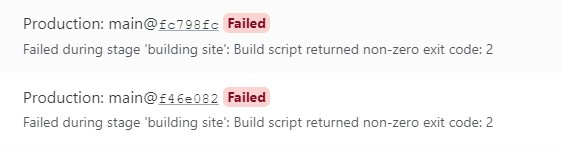

## Background

This project was suggested by Laurie during the initial drafting process of this Independent Study. I was initially skeptical of the idea as I felt like although it was a valuable skill, it wasn't entirely applicable to my education. Eventually accepting it as a method to organize my projects, my mind has been changed. I now understand website development and hosting as a valuable resource in a human ecological education. With so much information today being hosted on the internet, being able to understand how that information is being hosted and to make use of those tools is valuable knowledge.

## Process

Prior to this project, I'd never really taken the time to understand websites and how they are built and hosted. It was one of those concepts that I thought I understood, but if I really delved into it I would find that I understood very little. As such, the beginning of this project was a lot. Having BlogDown build a website off of a single line of code was miraculous and made me really appreciate all of the resources built by previous developers, but the hosting process felt like I was stumbling around and narrowly avoiding disaster. I had several instances when the website would fail to build, or only load HTML, and it was clear that such bugs had me in a little over my head. 

Despite that, I gained proficiency. If I was to undergo the process again, which I intend to for my personal Photography website, my gained understanding would make the process a lot smoother.

Once the website was built and hosted, it was simply a process of customization. Having a limited demand for many of the tools in the template, it was a lot of cutting out structures which gave me a surprising amount of comprehension. With an entry level understanding of these things, it's amazing how beneficial simply figuring out how to remove items is. 

## Going forward

I have found myself now a bit frustrated with the template. I still evidently have much to learn on the topic, so there are number of aspects of the website that are built on code that I cannot find the source for, and therefore am unable to customize. It works for this project, but it is clear to me that there is plenty of room for growth in this area going forward, and I intend to capitalize on that. Also suggested during the drafting of this Independent Study, the idea of building my own photography website is alluring to me, given that I've struggled often to find a site that gives me the freedom that I want while also not being overly expensive. Based on my current knowledge, I know that to accomplish what I want with that site will require a much more in-depth understanding of website building, and I am excited to continue that learning!