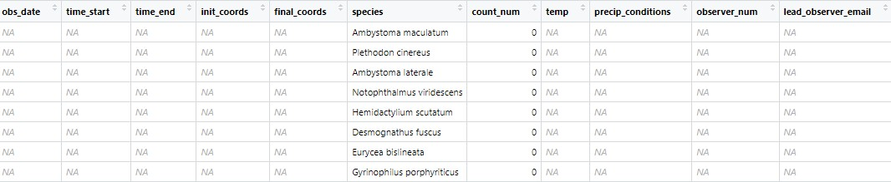
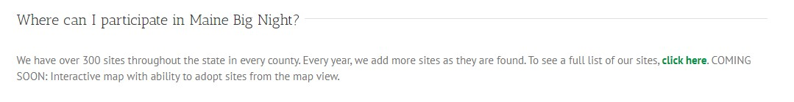

## Background
My initial idea for this project developed even before I learned my first bit of R. For years I have been enthralled by the mass migration of salamanders and other amphibians that occurs every spring. Each spring I go out in search of them, hoping to see some cool species and help them safely cross them cross the road at major intersection points. I gradually learned about local efforts toward the same goal. The format usually followed this path: A nature center, land trust, or environmental action team would provide training for volunteers, and then volunteers would sign up for a high volume crossing location to monitor throughout nights of migration. This was fantastic, but there was a problem. Each individual program was heavily based around one specific location, for one specific year. Each initiative was for a localized area outside of my hometown, and later I was frustrated to find one with coverage of my area (now MDI) that appeared to simply not be initiated for the 2023 season. My plan, therefore, was to create a citizen science program that was far broader in region, accessible to anyone in an area of the US that experienced a vernal mass migration of amphibians, and would be much easier to continue from year to year, fully operated over the internet. Of course, this was a massive undertaking, but when I started learning R, and was introduced to the RShiny app builder, I though I may as well get started by building an app wherein the user can input data that will be formatted properly and written to a .csv file which would ultimately be saved to a national database.

## Process
I had an inkling prior, and quickly confirmed the suspicion as I got working, that an application of the volume that I'd envisioned as a final product would require a much more robust system. In starting to build, I began noticing points where a usually simple aspect would need to be much more comprehensive. When an app is being developed for a broad userbase, I realized, it has to be able to deal with literally every possible choice, as well as be as simple and intuitive as possible. For instance, although for such scientific pursuits I would normally jump to using Celcius for temperature measurement, asking for Farenheit would make the form much easier for the majority of users.

Working through the UI and the server logic behind it, I found that I was getting exactly what I'd hoped: The practice that I'd gotten over the summer while working on the Mapping Ocean Stories project was being reviewed and strengthened. Concepts that I hadn't really grasped were being repeated until it was second nature, and those that I remembered well were used to build a base for the rest of the learning, while being reinforced and deepend for themselves.

A leaflet map for selecting the observation location in the name of ease of use proved my biggest challenge, to the point that I decided to move past it. In the process I learned a great deal about leaflet interactivity and working with Shiny, but in the end I couldn't get them to work together. In the case that I continue building this, that would be the next detail to complete. 

I also reworked my method a bit. My idea was to generate a template:

From this, I would add observations into cells as they were inputted by the user. After building this, I realized that this is a tad unnecessary because using mutate() means that I don't really need to pre-generate to columns. Still, I kept the process because I believe that in the case of building out the app further, it would make the process a bit more robust. I also had to make the compromise of solely working with salamanders, as I could have had a full registry of all herpetofauna of Maine, but given that this is more of a concept draft I decided that my time would be better suited elsewhere.

In the end, I hosted the app using shinyapps.io, and it available here!
[The Amphibian Data Collector](https://weopkb-will-draxler.shinyapps.io/amphibiandatacollector/)

## Going forward
It wasn't until I was doing this write up, when I went to check for the local land trust that had disapointed me, that I found the [Vernal Pools Of Maine website](https://www.vernalpools.me/big-night/), and specifically [this page](https://www.vernalpools.me/big-night-Volunteer-Materials-and-Training/), which contains almost exactly the system I'd envisioned. It works across all of Maine, and would require minimal effort to maintain from year to year. Although I'd just spent all this time building a chunk of the same process, I'm really happy to see this. I didn't expect to be the only one who had this goal, and it's lovely to see it executed so well. What I really want to do now is contribute to this effort! This is headed by a masters student, Greg LeClair at UMaine, and we've talked about bit on the topic of me contributing to the project going forward. One thing that has caught my eye is this:

Building a map-based method of selecting a site location would be a perfect way to strengthen the weakness I found in my leaflet-shiny coordination usage, and if it's indended to be done using GIS, that would also line up well with my learning of the subject in the coming term. Out of all the projects this term, this has left me especially excited to continue into the future.

Regardless of how that project goes though, this focus on Shiny has really showed me the power of the tool. I've seen how, with enough practice, I could make use of Shiny apps quite regularly. This process has brought up several ideas for use in personal apps, and I can envision countless academic situations that could use a little RShiny app. I'm genuinely looking forward to making more, despite the fact that the process can be a bit frustrating at times.